# Abby's Left Hand Modifiers Dictionary

* [Design](#Abby's Left Hand Modifiers Dictionary#Design)
* [Modifiers](#Abby's Left Hand Modifiers Dictionary#Modifiers)
  * [Single modifier keys](#Abby's Left Hand Modifiers Dictionary#Modifiers#Single modifier keys)
  * [Modifier key combinations](#Abby's Left Hand Modifiers Dictionary#Modifiers#Modifier key combinations)
* [Keys](#Abby's Left Hand Modifiers Dictionary#Keys)
  * [Letters](#Abby's Left Hand Modifiers Dictionary#Keys#Letters)
  * [Numbers](#Abby's Left Hand Modifiers Dictionary#Keys#Numbers)
  * [Function Keys](#Abby's Left Hand Modifiers Dictionary#Keys#Function Keys)
  * [Numpad](#Abby's Left Hand Modifiers Dictionary#Keys#Numpad)
  * [Symbol keys](#Abby's Left Hand Modifiers Dictionary#Keys#Symbol keys)
  * [Navigation keys](#Abby's Left Hand Modifiers Dictionary#Keys#Navigation keys)
  * [Other keys](#Abby's Left Hand Modifiers Dictionary#Keys#Other keys)
  * [Only modifiers](#Abby's Left Hand Modifiers Dictionary#Keys#Only modifiers)
  * [Cancel](#Abby's Left Hand Modifiers Dictionary#Keys#Cancel)
* [Examples](#Abby's Left Hand Modifiers Dictionary#Examples)

## Design

This dictionary is inspired by and can essentially be seen as a combination of
[Emily's Modifiers](https://github.com/EPLHREU/emily-modifiers) and 
[Achim Siebert's Left Hand Modifier Keys](http://www.openstenoproject.org/stenodict/dictionaries/lh_modifier_keys.html).
Essentially, it allows every shortcut to be typed in two strokes and using only
the left hand. As such, only the following keys are used:

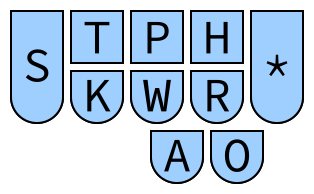

In some combinations, the asterisk key is used. This requires the asterisk key
to be pressed using the left hand, which should be fine on most hobbyist writers
but may be a problem on some professional writers.

## Modifiers

The first of the two strokes in each combination is used to specify the modifier
keys that should be pressed. It is also possible to not press any modifier keys,
since some applications have shortcuts that are activated by just a single
keypress.

### Single modifier keys

Patterns for single modifier keys.

| Stroke             | Modifier | Explanation                          |
| ---                | ---      | ---                                  |
| 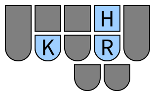  | Control  | **C**ontro**L**                      |
| 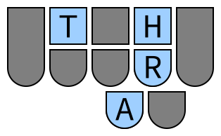   | Alt      | **ALT** (reversed)                   |
| 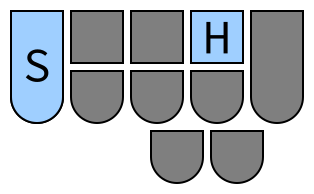 | Shift    | **SH**ift                            |
| 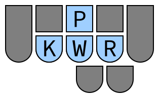 | Super    | Purely positional, no phonetic basis |

### Modifier key combinations

The pattern for the alt + shift combination is `SHA`.

| Stroke                 | Modifiers   |
| ---                    | ---         |
| 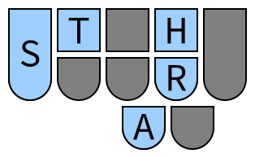 | Alt + Shift |

Combinations using control (but not super) are formed using `KHR` for control
and adding `A` for alt and `S` for shift.

| Stroke                      | Modifiers          |
| ---                         | ---                |
| 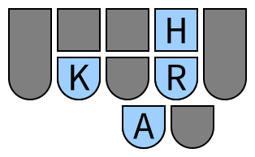       | Ctrl + Alt         |
| 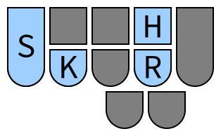     | Ctrl + Shift       |
| 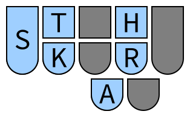 | Ctrl + Alt + Shift |

Combinations using super are formed using `KPWR` for super and adding `H` for
control, `A` for alt, and `S` for shift.

| Stroke                            | Modifiers                  |
| ---                               | ---                        |
| 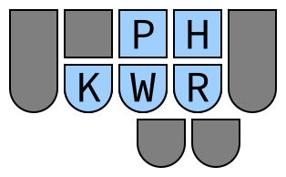           | Ctrl + Super               |
| 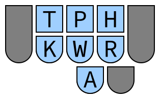            | Alt + Super                |
| 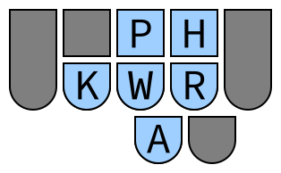       | Ctrl + Alt + Super         |
| 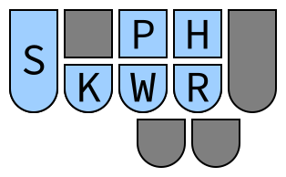          | Shift + Super              |
| 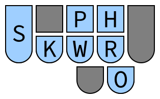     | Ctrl + Shift + Super       |
| 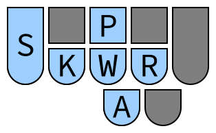      | Alt + Shift + Super        |
| 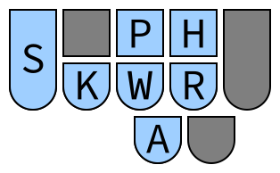 | Ctrl + Alt + Shift + Super |

The pattern for no modifier keys is `TKPWHR`. This presses a key alone without
any modifier keys.

| Stroke                    | Modifiers |
| ---                       | ---       |
| 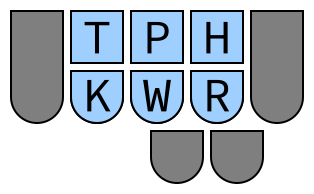 | None      |

## Keys

The second of the two strokes in each combination specifies what key to press
along with the modifiers (if any) selected above.

### Letters

The patterns for letter keys are the same as the fingerspelling pattern for that
letter (without the asterisk), except for E, I, and U which have been given
special patterns so they fit on the left hand. (Using `E`, `EU`, and `U` for E,
I, and U still work, but are not shown below.)

| Stroke          | Letter          |
| ---             | ---             |
| 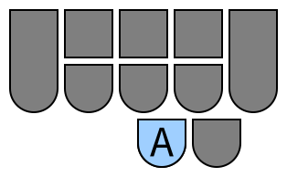  | `A`             |
| 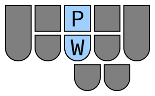  | `B`             |
| 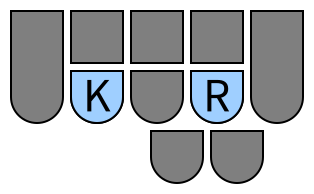  | `C`             |
| 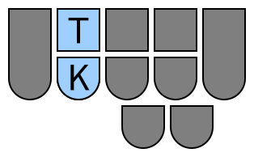  | `D`             |
| 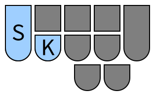  | `E`             |
| 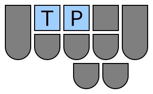  | `F`             |
| 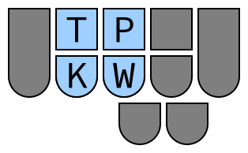  | `G`             |
| 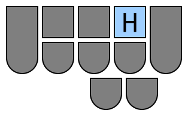  | `H`             |
| 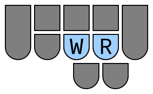  | `I`             |
| 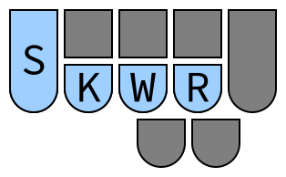  | `J`             |
| 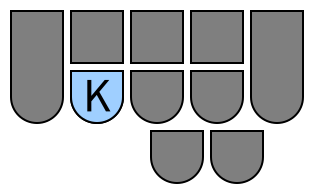  | `K`             |
| 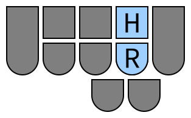  | `L`             |
| 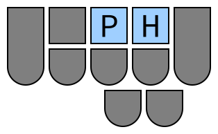  | `M`             |
| 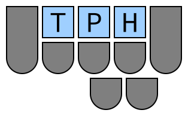  | `N`             |
| 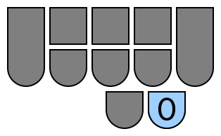  | `O`             |
| 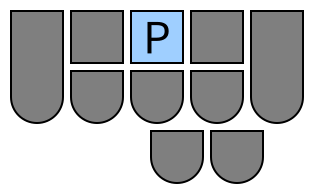  | `P`             |
| 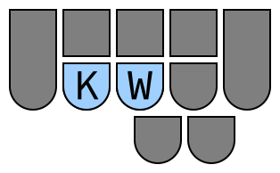  | `Q`             |
| 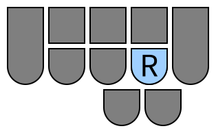  | `R`             |
| 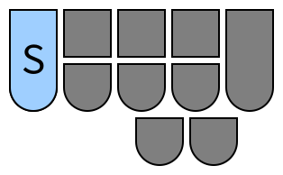  | `S`             |
| 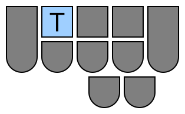  | `T`             |
| 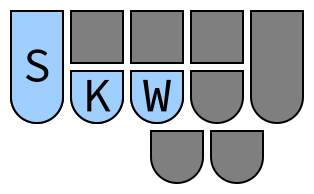  | `U`             |
| 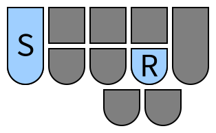  | `V`             |
| 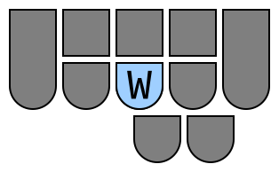  | `W`             |
| 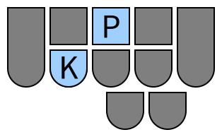  | `X`             |
| 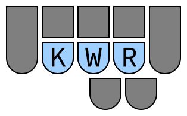  | `Y`             |
| 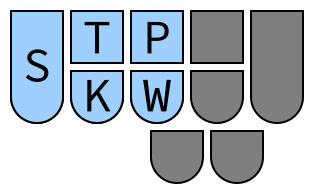  | `Z`             |
| 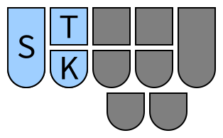 | `Z` (alternate) |

### Numbers

When `AO` is held, `STPH` will act as binary number input for numbers 0-9.

| Stroke         | Number |
| ---            | ---    |
| 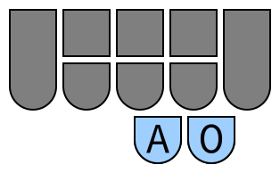 | `0`    |
|  | `1`    |
| 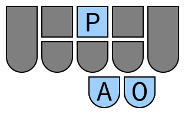 | `2`    |
|  | `3`    |
| 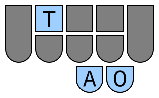 | `4`    |
| 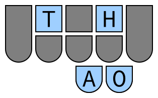 | `5`    |
| 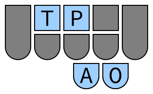 | `6`    |
| 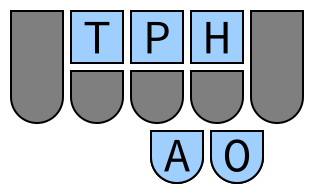 | `7`    |
|  | `8`    |
|  | `9`    |

### Function Keys

When `R` is held in addition to the pattern for any number 1-12, the
corresponding function key will be used.

| Stroke           | Number |
| ---              | ---    |
|   | `F1`   |
|   | `F2`   |
|   | `F3`   |
|   | `F4`   |
|   | `F5`   |
|   | `F6`   |
|   | `F7`   |
|   | `F8`   |
|   | `F9`   |
|  | `F10`  |
|  | `F11`  |
|  | `F12`  |

### Numpad

When `*` is held in addition to the pattern for any number, the number key on
the numpad will instead be used.

| Stroke            | Number       |
| ---               | ---          |
|  | `0` (numpad) |
|  | `1` (numpad) |
|  | `2` (numpad) |
|  | `3` (numpad) |
|  | `4` (numpad) |
|  | `5` (numpad) |
|  | `6` (numpad) |
|  | `7` (numpad) |
|  | `8` (numpad) |
|  | `9` (numpad) |

### Symbol keys

| Stroke                    | Key | Explanation           |
| ---                       | --- | ---                   |
|        | `.` | **P**e**R**iod        |
|         | `,` | **C**o**MM**a         |
|         | `/` | **SL**ash             |
|     | `\` | **B**ack**SL**ash     |
|     | `;` | **S**emi**C**o**L**on |
|    | `'` | **QUO**te             |
|   | `[` | **B**racket **L**eft  |
|  | `]` | **B**racket **R**ight |
|         | `-` | **D**as**H**          |
|         | `=` | e**QUA**ls            |
|         | `   | **GR**ave             |

### Navigation keys

Holding down `A` (for **a**rrow) will cause `PKWR` to act as arrow keys.

| Stroke             | Key   |
| ---                | ---   |
|     | Up    |
|   | Down  |
|   | Left  |
|  | Right |

Holding down `*` in addition to the stroke for any arrow key will cause the keys
to act as page up, page down, home, and end.

| Stroke             | Key       |
| ---                | ---       |
|  | Page Up   |
|   | Page Down |
|   | Home      |
|    | End       |

### Other keys

| Stroke                   | Key          | Explanation                    |
| ---                      | ---          | ---                            |
|    | Caps Lock    | **C**aps **L**ock + asterisk   |
|  | Scroll Lock  | **SC**roll **L**ock + asterisk |
|     | Num Lock     | **N**um lock + asterisk        |
|        | Space        | **SP**ace                      |
|       | Return       | **ENT**e**R**                  |
|          | Tab          | **T**a**B**                    |
|    | Backspace    | **B**ack**S**pace              |
|       | Delete       | **D**e**L**ete                 |
|       | Escape       | e**SCA**pe                     |
|       | Insert       | i**NS**ert                     |
|         | Menu         | **M**enu + asterisk            |
|        | Print Screen | **SC**reen **PR**int           |

### Only modifiers

The pattern `TPHO` ("no") allows only modifier keys to be pressed, with no other
keys included.

| Stroke          | Key  |
| ---             | ---  |
|  | None |

### Cancel

If you pressed a modifier key pattern on accident, you can use `SKPH` to cancel
it.

| Stroke              | Key    |
| ---                 | ---    |
|  | Cancel |

## Examples

| Strokes                                      | Keys Pressed        | Use                             |
| ---                                          | ---                 | ---                             |
|               | Ctrl + A            | Select all (Windows or Linux)   |
|              | Super + A           | Select all (Mac)                |
|               | Alt + F4            | Close window (Windows or Linux) |
|           | Ctrl + Alt + T      | Open terminal (Linux)           |
|             | Super (Windows key) | Open start menu (Windows)       |
|   | Print Screen        | Take screenshot                 |
